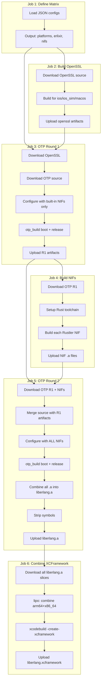
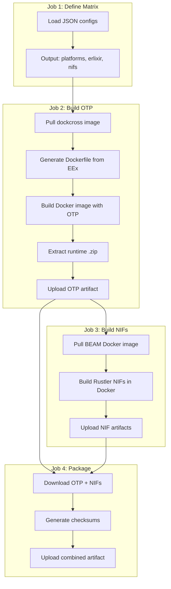

# Build Architecture

This document explains the build system for compiling Erlang/OTP and Rustler NIFs for mobile platforms.

## Overview

The project produces static libraries (`.a` files) containing the BEAM VM and native code that can be embedded in iOS and Android applications via the elixir-desktop ecosystem.

## Platform Support

| Platform | Architectures | Output |
|----------|---------------|--------|
| iOS | arm64 | `liberlang.xcframework` |
| iOS Simulator | arm64, x86_64 | (included in xcframework) |
| macOS | arm64, x86_64 | (included in xcframework) |
| Android | arm64-v8a, armeabi-v7a, x86_64 | `.zip` archives |

## Configuration Files

All build matrices are defined in JSON files under `.github/config/`:

```
.github/config/
├── apple-platforms.json    # iOS/macOS platform definitions
├── android-platforms.json  # Android architecture definitions
├── erlixir-versions.json   # OTP/Elixir version matrix
└── nif-packages.json       # Rustler NIF definitions (auto-generated)
```

The NIF packages configuration is generated from `lib/runtimes.ex`. Keep them in sync:
```bash
mix run -e "Runtimes.write_nif_packages_json()"
```

## iOS/macOS Build Pipeline

The Apple build uses a 2-round OTP compilation strategy to properly link external NIFs.



### Why Two Rounds?

OTP's build system needs to know about all static NIFs at configure time to properly set up linking. However, external NIFs (like Rustler-based ones) need ERTS headers to compile.

**Round 1**: Build OTP with only built-in NIFs (`asn1rt_nif`, `crypto`). This produces the ERTS headers needed by Rustler.

**Round 2**: Re-configure OTP with the full list of NIFs (built-in + external) and rebuild. The final `liberlang.a` includes everything statically linked.

### File Permission Handling

GitHub artifacts don't preserve Unix execute permissions. After downloading R1 artifacts, the workflow restores permissions:

```bash
chmod +x _build/otp_builder/otp_build
find _build/otp_builder -name "yielding_c_fun" -exec chmod +x {} \;
find _build/otp_builder -path "*/bin/*" -type f -exec chmod +x {} \;
```

## Android Build Pipeline

Android builds use Docker with dockcross cross-compilation images.



### Docker Images

Android builds use cached Docker images stored in GitHub Container Registry:

- **Base**: `dockcross/android-{arch}:20250311-4bd0eec`
- **BEAM**: `ghcr.io/{owner}/android_beam:arch_{identifier}-{otp_version}`

The Dockerfile is generated dynamically by `Mix.Tasks.Package.Android.Runtime`.

## NIF Registry

NIFs are defined in `lib/runtimes.ex` with metadata for cross-compilation:

```elixir
@nif_registry %{
  "btleplug_client" => %{
    repo: "https://github.com/adiibanez/rustler_btleplug.git",
    ref: "static-no-precompiled",
    type: :rustler,
    native_dir: "native/btleplug_client",
    ldflags: "-framework CoreBluetooth ...",
    skip_3rd_tier: false
  },
  # ...
}
```

Key fields:
- `type`: `:rustler` or `:c_nif`
- `native_dir`: Path to Rust crate within the repo
- `ldflags`: Frameworks/libraries to link (iOS only)
- `skip_3rd_tier`: Skip experimental Rust targets (e.g., `aarch64-apple-tvos`)

## Package Flavors

Different NIF combinations for various use cases:

| Flavor | NIFs | Use Case |
|--------|------|----------|
| `vanilla` | exqlite | Minimal, just SQLite |
| `crypto` | esqlite, libsecp256k1 | Diode chain compatible |
| `iroh` | exqlite, iroh_ex | P2P networking |
| `ble` | exqlite, btleplug_client | Bluetooth LE |
| `full` | All available | Everything |

Set via environment variable:
```bash
RUNTIME_FLAVOR=full mix package.ios.runtime
```

## Caching Strategy

| What | Cache Key | Retention |
|------|-----------|-----------|
| OTP source | `otp-source-{version}-{git-ref}` | Persistent |
| OpenSSL source | `openssl-source-{version}` | Persistent |
| OpenSSL build | `openssl-build-{version}-{os}-{arch}-{script-hash}` | Persistent |
| OTP R1 build | `otp-r1-{platform}-{version}-{opts}-{patch-hash}` | Persistent |
| Cargo registry | `cargo-nif-{name}-{target}` | Persistent |
| Intermediate artifacts | N/A | 1 day |

## Local Development

### Prerequisites

- Elixir 1.16+ / OTP 26+
- Xcode (for iOS builds)
- Docker (for Android builds)
- Rust nightly (for some NIFs)

### Building Locally

```bash
# iOS runtime
mix deps.get
RUNTIME_FLAVOR=vanilla mix package.ios.runtime

# Android runtime (requires Docker)
mix package.android.runtime --arch arm64

# Regenerate NIF config
mix run -e "Runtimes.write_nif_packages_json()"
```

### Environment Variables

| Variable | Default | Description |
|----------|---------|-------------|
| `RUNTIME_FLAVOR` | `vanilla` | NIF package flavor |
| `OTP_SOURCE` | GitHub | OTP git repository URL |
| `OTP_TAG` | `OTP-26.2.5.6` | OTP version tag |
| `OPENSSL_VERSION` | `3.4.0` | OpenSSL version |
| `ENABLE_STRIPPING` | `true` | Strip debug symbols |

## Related Files

- `lib/runtimes.ex` - NIF registry and flavor definitions
- `lib/mix/tasks/package_ios_runtime.ex` - iOS build task
- `lib/mix/tasks/package_android_runtime.ex` - Android build task
- `.github/actions/build-rustler-nif/` - Reusable NIF build action
- `.github/actions/openssl-ios/` - OpenSSL build action
- `patch/erl-xcomp-apple-multi-sdk.conf` - Erlang cross-compile config
